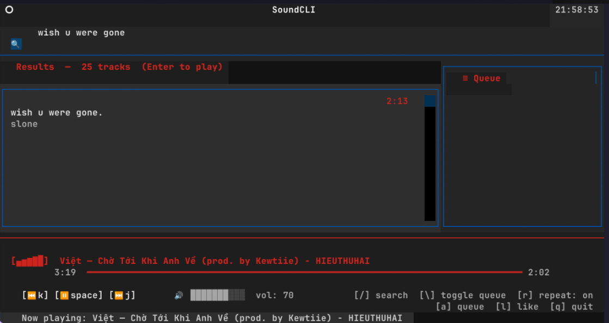

# soundcli

  

A terminal-based SoundCloud music player featuring a responsive TUI for intuitive track search, queue management, and real-time playback control without leaving the command line.

  

## Overview

  

soundcli provides a modern terminal interface for browsing and playing music from SoundCloud. The application integrates with the SoundCloud public API to enable full-featured music discovery and playback capabilities directly from your terminal.

  


  

## Requirements

  

- **Python** 3.11 or higher

- **mpv** media player for audio decoding and streaming

  

## Installation

  
### 1. Install mpv

  

```bash

# macOS

brew install mpv

```

  

```bash

# Ubuntu / Debian

sudo apt install mpv

```

  

```bash

# Windows

choco install mpv

```

  

### 2. Installation

  

```bash

# Clone or download the repository

cd soundcli

```

  

```bash

# Create and activate a Python virtual environment (Optional)

python -m venv .venv

source .venv/bin/activate # On Windows: .venv\Scripts\activate

```

  

```bash

# Install dependencies

pip install -r requirements.txt

```

  

```bash

export SC_CLIENT_ID="YOUR_CLIENT_ID"

export SC_AUTH_TOKEN="YOUR_TOKEN_HERE"

```

  

```bash

# Start the application

python main.py

```

  

## Keybindings

  

| Key | Action |
|-----|--------|
| `F` | Focus search bar |
| `Enter` | Play selected track |
| `Space` | Toggle play/pause |
| `N` | Play next track in queue |
| `A` | Add selected track to queue |
| `←` / `→` | Seek ±10 seconds |
| `↑` / `↓` | Adjust volume |
| `Q` | Exit application |

  

## Architecture

  

- **Search** — Queries the SoundCloud public API (`api-v2.soundcloud.com`) using an automatically scraped `client_id`

- **Stream Resolution** — Resolves track transcoding URLs to CDN `.mp3` or HLS streams for playback

- **Playback Engine** — Manages `mpv` subprocess with JSON IPC protocol for real-time control

- **User Interface** — Implemented with [Textual](https://github.com/Textualize/textual) for reactive, event-driven UI updates

- **Persistence** — Stores configuration, volume settings, and playback history in `~/.config/soundcli/config.json`

  

## Technical Notes

- You can find `SC_CLIENT_ID` and `SC_AUTH_TOKEN` in `https://soundcloud.com`

- Here is how you can get it and use it:

  

    1. Open SoundCloud in your browser and log in to your account.

    2. Open your browser's Developer Tools (F12 or Right Click -> Inspect).

    3. Go to the Application tab (Chrome/Edge) or Storage tab (Firefox).

    4. Under Cookies -> https://soundcloud.com, look for a cookie named oauth_token.

    5. Copy its value (it usually looks something like 2-29xxxx...).

- The SoundCloud `client_id` is automatically extracted from the SoundCloud web bundle on first startup. If extraction fails, a known fallback ID is used.

- Windows users should ensure `mpv` is available in the system PATH. The IPC socket uses a named pipe at `\\.\pipe\soundcli-mpv`.

- Playback control and volume adjustment operate through mpv's JSON IPC protocol over Unix sockets (or named pipes on Windows).